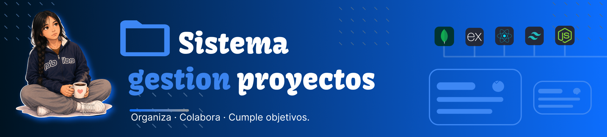

<div align="center">


# Project Management System

### Modern project management platform for software development teams.

Manage projects, collaborate with your team, assign tasks, track progress, and visualize project metrics in a single application.

[🌐 Live Demo](https://jhelcyprojects.netlify.app) • [⚙️ Backend API](https://prueba-tecnica-fullstack-backend.onrender.com)

</div>

---

## Features

###  Project Management

- Create, edit and delete projects.
- Upload project cover images.
- Assign developers to projects.
- Track project progress.
- Project dashboard.

###    Task Management

- Create tasks.
- Update task status.
- Assign tasks to developers.
- Priority management.
- Due dates.

###   User Management

- Authentication with JWT.
- Role-based permissions.
- Developer accounts.
- Project Manager accounts.
- Secure routes.

###    Analytics

- Project statistics.
- Progress charts.
- Task completion metrics.
- Team performance overview.

###    Security

- JWT Authentication.
- Protected API routes.
- Role authorization.
- Secure password handling.

---

# Tech Stack

## Frontend

| Technology | Description |
|------------|-------------|
| React 18 | UI Library |
| TypeScript | Static Typing |
| Vite | Build Tool |
| React Router DOM | Routing |
| React Hook Form | Forms |
| Axios | HTTP Client |
| Recharts | Charts |
| React Icons | Icons |

---

## Backend

- Node.js
- Express.js
- MongoDB
- Mongoose
- JWT Authentication
- Bcrypt
- Multer
- REST API

---

##    Deployment

| Service | Platform |
|----------|----------|
| Frontend | Netlify |
| Backend | Render |
| Database | MongoDB Atlas |

---

#  Project Structure

```
Project
│
├── frontend/
│   ├── src/
│   ├── public/
│   └── package.json
│
└── backend/
    ├── src/
    ├── routes/
    ├── controllers/
    ├── models/
    └── package.json
```

---

#  Installation

## Clone repository

Frontend

```bash
git clone https://github.com/your-username/Sistema-gestion-de-proyectos.git

cd project-management-system
```

Backend
```bash
git clone https://github.com/your-username/sgp-backend.git

cd sgp-backend
```

---

## Frontend

Install dependencies

```bash
npm install
```

Create the environment variables

```env
VITE_API_URL=http://localhost:5000
```

Run the project

```bash
npm run dev
```

---

## Backend

Install dependencies

```bash
npm install
```

Create the environment variables

```env
PORT=5000

MONGO_URI=

JWT_SECRET=

CLIENT_URL=http://localhost:5173
```

Run

```bash
npm run dev
```

---

#    User Roles

## Project Manager

- Create projects
- Edit projects
- Delete projects
- Assign developers
- Create tasks
- Manage the team

---

## Developer

- View assigned projects
- Update task status
- View project information
- Track assigned work

---

#   Authentication

The application uses **JWT Authentication** with protected routes and role-based authorization.

---

#    Main Modules

- Authentication
- Dashboard
- Projects
- Tasks
- Developers
- Team Management
- Analytics
- User Profile

---

#    Frontend Dependencies

```json
React
TypeScript
Vite
Axios
React Router DOM
React Hook Form
Recharts
React Icons
```

---

#    Future Improvements

- Notifications
- Comments
- Activity Timeline
- Calendar View
- Kanban Board
- File Attachments
- Email Notifications
- Dark Mode
- Search Filters
- Team Chat

---

#    Contributing

1. Fork the repository.
2. Create a feature branch.
3. Commit your changes.
4. Push the branch.
5. Open a Pull Request.

---

#    License

This project is licensed under the MIT License.

---

<div align="center">

Built with    using React, TypeScript, Node.js and MongoDB.



</div>